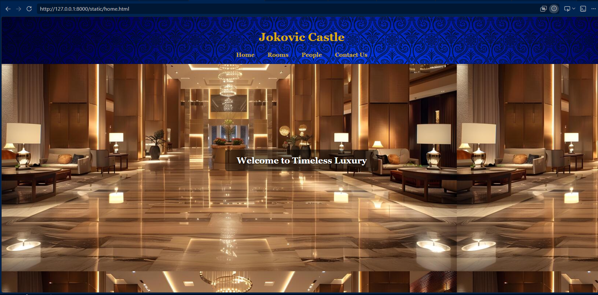
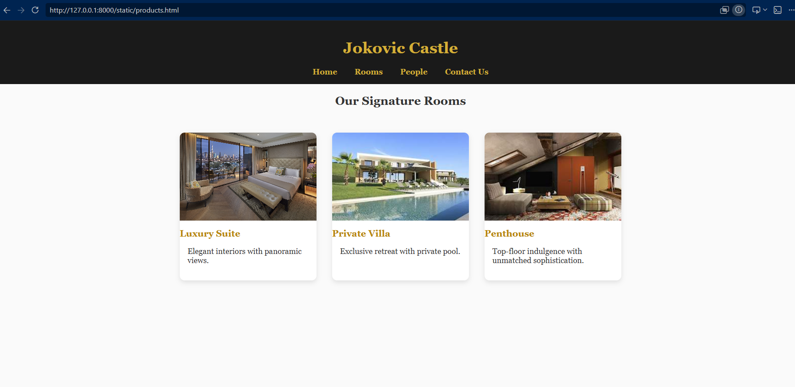
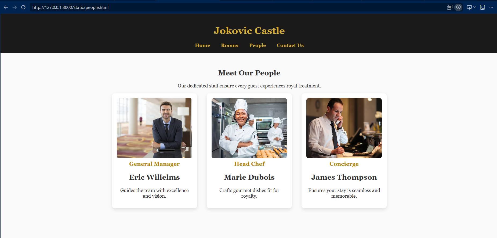
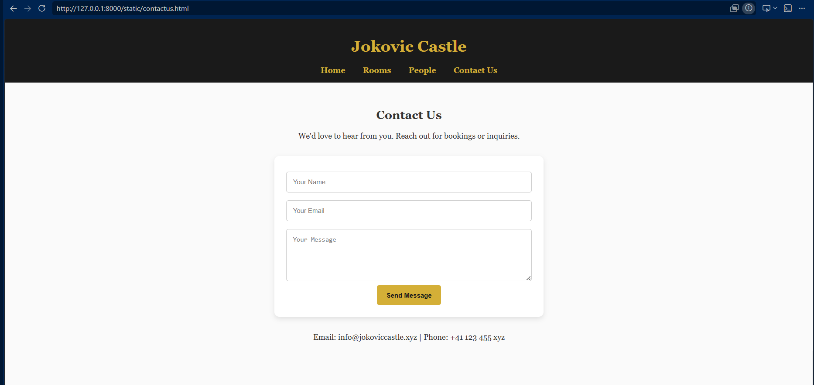

# Ex.06 Restuarant Website
## Date: 21.05.2026

## AIM:
To develop a static Resturant website to display the menu and services provided by the resturant.

## DESIGN STEPS:

### Step 1:
Requirement collection.

### Step 2:
Creating the layout using HTML and CSS.

### Step 3:
Updating the sample content.

### Step 4:
Choose the appropriate style and color scheme.

### Step 5:
Validate the layout in various browsers.

### Step 6:
Validate the HTML code.

### Step 7:
Publish the website in the given URL.

## PROGRAM:

### home.html

```
<html>
<head>
  <title>Jokovic Castle - Home</title>
  <style>
    body { margin:0; font-family:'Georgia',serif; background-image:url('background.jpeg'); color:#333; }
    header { background-image:url('head_bg.jpg'); color:#dcad13; padding:1rem; text-align:center; }
    nav a { color:#d4af37; margin:0 1rem; text-decoration:none; font-weight:bold; }
    .hero { background:url('luxury-hotel.jpg') center/cover no-repeat; height:70vh;
            display:flex; align-items:center; justify-content:center; color:#fff;
            text-shadow:2px 2px 6px rgba(0,0,0,0.7); }
    .hero h2 { background:rgba(0,0,0,0.5); padding:1rem 2rem; border-radius:8px; }
  </style>
</head>
<body>
  <header>
    <h1>Jokovic Castle</h1>
    <nav>
      <a href="home.html">Home</a>
      <a href="products.html">Rooms</a>
      <a href="people.html">People</a>
      <a href="contactus.html">Contact Us</a>
    </nav>
  </header>
  <div class="hero">
    <h2>Welcome to Timeless Luxury</h2>
  </div>
</body>
</html>

```

### products.html

```
<html>
<head>
  <title>Jokovic Castle - Products</title>
  <style>
    body { margin:0; font-family:'Georgia',serif; background:#fafafa; color:#333; }
    header { background:#1a1a1a; color:#d4af37; padding:1rem; text-align:center; }
    nav a { color:#d4af37; margin:0 1rem; text-decoration:none; font-weight:bold; }
    .cards { display:flex; justify-content:center; gap:2rem; flex-wrap:wrap; padding:2rem; }
    .card { background:#fff; border-radius:10px; box-shadow:0 4px 10px rgba(0,0,0,0.1);
            width:280px; overflow:hidden; transition:transform 0.3s; }
    .card:hover { transform:scale(1.05); }
    .card img { width:100%; height:180px; object-fit:cover; }
    .card h3 { margin:1rem 0 0.5rem; color:#b8860b; }
    .card p { padding:0 1rem 1rem; }
  </style>
</head>
<body>
  <header>
    <h1>Jokovic Castle</h1>
    <nav>
      <a href="home.html">Home</a>
      <a href="products.html">Rooms</a>
      <a href="people.html">People</a>
      <a href="contactus.html">Contact Us</a>
    </nav>
  </header>
  <section>
    <h2 style="text-align:center;">Our Signature Rooms</h2>
    <div class="cards">
      <div class="card">
        
        <h3>Luxury Suite</h3>
        <p>Elegant interiors with panoramic views.</p>
      </div>
      <div class="card">
        
        <h3>Private Villa</h3>
        <p>Exclusive retreat with private pool.</p>
      </div>
      <div class="card">
        
        <h3>Penthouse</h3>
        <p>Top-floor indulgence with unmatched sophistication.</p>
      </div>
    </div>
  </section>
</body>
</html>

```

### people.html

```
<html>
<head>
  <title>Jokovic Castle - People</title>
  <style>
    body { margin:0; font-family:'Georgia',serif; background:#fafafa; color:#333; }
    header { background:#1a1a1a; color:#d4af37; padding:1rem; text-align:center; }
    nav a { color:#d4af37; margin:0 1rem; text-decoration:none; font-weight:bold; }
    section { padding:2rem; text-align:center; }
    .team { display:flex; justify-content:center; gap:2rem; flex-wrap:wrap; }
    .member { width:250px; background:#fff; border-radius:10px; box-shadow:0 4px 10px rgba(0,0,0,0.1); padding:1rem; }
    .member img { width:100%; height:200px; object-fit:cover; border-radius:8px; }
    .member h3 { margin:0.5rem 0; color:#b8860b; }
  </style>
</head>
<body>
  <header>
    <h1>Jokovic Castle</h1>
    <nav>
      <a href="home.html">Home</a>
      <a href="products.html">Rooms</a>
      <a href="people.html">People</a>
      <a href="contactus.html">Contact Us</a>
    </nav>
  </header>
  <section>
    <h2>Meet Our People</h2>
    <p>Our dedicated staff ensure every guest experiences royal treatment.</p>
    <div class="team">
      <div class="member">
        
        <h3>General Manager</h3>
        <h2>Eric Willelms</h2>
        <p>Guides the team with excellence and vision.</p>
      </div>
      <div class="member">
        
        <h3>Head Chef</h3>
        <h2>Marie Dubois</h2>
        <p>Crafts gourmet dishes fit for royalty.</p>
      </div>
      <div class="member">
        
        <h3>Concierge</h3>
        <h2>James Thompson</h2>
        <p>Ensures your stay is seamless and memorable.</p>
      </div>
    </div>
  </section>
</body>
</html>

```

### contactus.html

```
<html>
<head>
  <title>Jokovic Castle - Contact Us</title>
  <style>
    body { margin:0; font-family:'Georgia',serif; background:#fafafa; color:#333; }
    header { background:#1a1a1a; color:#d4af37; padding:1rem; text-align:center; }
    nav a { color:#d4af37; margin:0 1rem; text-decoration:none; font-weight:bold; }
    section { padding:2rem; text-align:center; }
    form { max-width:500px; margin:2rem auto; background:#fff; padding:1.5rem; border-radius:10px; box-shadow:0 4px 10px rgba(0,0,0,0.1); }
    input, textarea { width:100%; padding:0.8rem; margin:0.5rem 0; border:1px solid #ccc; border-radius:5px; }
    button { background:#d4af37; color:#1a1a1a; padding:0.8rem 1.2rem; border:none; border-radius:5px; font-weight:bold; cursor:pointer; }
    button:hover { background:#b8860b; }
  </style>
</head>
<body>
  <header>
    <h1>Jokovic Castle</h1>
    <nav>
      <a href="home.html">Home</a>
      <a href="products.html">Rooms</a>
      <a href="people.html">People</a>
      <a href="contactus.html">Contact Us</a>
    </nav>
  </header>
  <section>
    <h2>Contact Us</h2>
    <p>We'd love to hear from you. Reach out for bookings or inquiries.</p>
    <form>
      <input type="text" placeholder="Your Name" required>
      <input type="email" placeholder="Your Email" required>
      <textarea rows="5" placeholder="Your Message"></textarea>
      <button type="submit">Send Message</button>
    </form>
    <p>Email: info@jokoviccastle.xyz | Phone: +41 123 455 xyz</p>
  </section>
</body>
</html>

```

## OUTPUT:













## RESULT:

The program for designing software company website using HTML and CSS is completed successfully.
